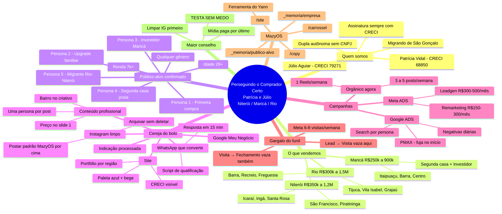

# Perseguindo o Comprador Certo — Patrícia e Júlio, Corretores de Imóveis

> Mapa mental de posicionamento inspirado no "Perseguindo os Milionários" do Luan Coutinho,
> adaptado pra dupla de corretores autônomos (não é franquia, não é CNPJ).
> **Atualizado em 29/07/2026** com o público-alvo confirmado pela Patrícia (renda 7k+, 26+, Niterói / Maricá / Rio).
> O MazyOS lê esse arquivo pra calibrar carrossel, anúncio, copy e site.

**Contexto de operação:** Patrícia Vidal (CRECI 68850) + Júlio Aguiar (CRECI 79271). Base: Niterói / Maricá / Rio (mudança de praça em curso — antes era São Gonçalo). Ticket entre R$ 250k e R$ 1,5M. Canais atuais: Instagram + Facebook (Instagram em limpeza, ver `saidas/instagram-limpeza-plano.md`). Sem site. Gargalo real: 30 leads/semana → só 2 visitas → 0 fechamento no mês.

---

## 1. Quem somos

- **Patrícia Vidal** — Corretora de Imóveis — CRECI 68850
- **Júlio Aguiar** — Corretor de Imóveis — CRECI 79271
- Dupla autônoma que vende junto
  - Não somos CNPJ — nada de logo de marca
  - Toda comunicação assina "Corretores de Imóveis" + nome + CRECI (exigência legal)
- Base atual: Niterói / Maricá / Rio de Janeiro
- Origem: São Gonçalo (praça anterior, ficou pra trás no reposicionamento)
- Antes: vendiam plano de saúde
- Hoje: 100% corretagem
- Diferencial que o mercado local não entrega
  - Atendimento pessoal (não call center, não robô)
  - Dois cérebros no mesmo cliente (Patrícia + Júlio se cobrem)

## 2. O que vendemos (não é franquia — é atendimento próprio)

- **Niterói — R$ 350k a R$ 1,2M**
  - Bairros que casam: Icaraí, Ingá, Santa Rosa, São Francisco, Piratininga, Fonseca (parte)
  - Perfil: qualidade de vida, saída do Rio, escola dos filhos
- **Maricá — R$ 250k a R$ 900k**
  - Bairros que casam: Itaipuaçu, Barra de Maricá, Centro, Ponta Negra, Inoã
  - Perfil dividido: segunda casa (praia) + investidor (royalties)
- **Rio de Janeiro — R$ 300k a R$ 1,5M**
  - Bairros que casam: Tijuca, Vila Isabel, Grajaú, Méier, Barra, Recreio, Freguesia, Taquara
  - Perfil: proximidade de trabalho, mobilidade, infra consolidada
- **Como entregamos diferente**
  - Atendimento por WhatsApp em blocos de horário definidos
  - Portfólio organizado por região e faixa
  - Visita agendada com roteiro (não "aparece lá que a gente vê")

## 3. Público-alvo (o que a Patrícia confirmou)

- **Renda:** a partir de R$ 7 mil/mês
- **Idade:** 26+
- **Gênero:** qualquer
- **Região do imóvel:** Niterói, Maricá, Rio

Dentro desse público, existem **5 personas** — cada criativo escolhe uma. Detalhe completo em `_memoria/publico-alvo.md`:

- **Persona 1 — Primeira compra consciente** (26–34, R$ 7–15k, 2 quartos com FGTS)
- **Persona 2 — Upgrade familiar** (32–45, R$ 12–25k, 3Q + escola + lazer)
- **Persona 3 — Investidor Maricá** (28–55, R$ 10k+, aposta na valorização dos royalties)
- **Persona 4 — Segunda casa / praia** (38–60, R$ 15k+, próximo ao mar)
- **Persona 5 — Migrante do Rio pra Niterói** (30–45, R$ 10–25k, cansado do Rio)

**De onde vem lead hoje:** Facebook, indicação, parceiro (~30/semana).

## 4. Cereja do bolo (o que os outros corretores da região não fazem)

- **Lembrete 80/20:** o que decide a venda não é o anúncio — é o que vem depois
- **Instagram limpo e no padrão**
  - Feed atual bagunçado — plano de limpeza em `saidas/instagram-limpeza-plano.md`
  - Arquivar (não deletar) posts fora do padrão
  - Começar a postar carrosséis no padrão MazyOS por cima
  - Manter conta, seguidores e histórico de engajamento
- **Site (não tem hoje — prioridade)**
  - Página institucional: Patrícia e Júlio + CRECIs bem visíveis
  - Portfólio segmentado por região (Niterói / Maricá / Rio) e faixa
  - Formulário curto: nome, WhatsApp, região, faixa de investimento, financiamento aprovado ou não
  - Depoimento em vídeo de cliente que já comprou
  - Paleta oficial: Navy #2F4156 · Teal #567C8D · Sky Blue #C8D9E6 · Beige #F5EFEB · White #FFFFFF
- **Conteúdo profissional (sair de amador)**
  - Carrossel com identidade consistente — não improviso no Canva
  - Copy com diferencial: benefício concreto em tópicos + preço no primeiro slide
  - Bairro no criativo ("Apartamento em Icaraí" converte mais que "apartamento em Niterói")
  - Foto/vídeo do imóvel por dentro — nunca só fachada
  - Um Reels por semana mostrando um imóvel em 30s
  - Zero clichê: "vamos juntos", "realize seu sonho", "alavancar" — não entra
- **WhatsApp que converte (aqui é onde vaza hoje)**
  - Resposta em até 15 minutos no horário comercial
  - Script de qualificação: região desejada, faixa, prazo, financiamento pré-aprovado
  - Áudio curto de apresentação (Patrícia OU Júlio) no primeiro contato
  - Follow-up marcado no calendário — não "depois eu lembro"
- **Indicação virou processo**
  - Pedir indicação depois de cada fechamento
  - Lembrança/mimo pra quem indica cliente que fecha
  - Post público agradecendo o indicador (com autorização)
- **Google Meu Negócio otimizado**
  - "Patrícia e Júlio — Corretores de Imóveis em Niterói / Maricá / Rio"
  - Foto profissional dos dois
  - Reviews pedidas ativamente

## 5. Campanhas

- **Orgânico agora (sem custo — prioridade máxima)**
  - 3 a 5 posts por semana no IG e FB
  - 1 Reels por semana mostrando imóvel por dentro
  - Story diário: bastidor, cliente novo, imóvel novo
  - Cross-posting no Facebook (canal que mais traz lead hoje)
- **Meta ADS (IG + FB) — quando abrir verba**
  - **Leadgen de imóvel específico**
    - Orçamento inicial: R$ 300 a R$ 500/mês
    - 1 conjunto de anúncios
    - 3 anúncios variando criativo (foto interna / vídeo / carrossel) e copy
    - Público: raio 25 km Niterói + raio 20 km Maricá + Zona Norte/Oeste Rio
    - Idade 26–60, ambos os gêneros, interesses de camada 1 (comprar imóvel, financiamento, ZAP/VivaReal)
  - **Remarketing / Reconhecimento**
    - Orçamento: R$ 150 a R$ 300/mês
    - Público: quem visitou o site e não deixou WhatsApp
    - 1 conjunto, 3 anúncios com prova social
- **Google ADS — fase seguinte**
  - **Search — intenção de compra**
    - Palavra-chave por persona (ver `_memoria/publico-alvo.md`)
    - Negativas obrigatórias: aluguel, temporada, decoração, planta baixa DWG, curso, arquiteto
    - Título e descrição em tópicos com benefício
    - Orçamento inicial: R$ 50 a R$ 80/dia
    - Otimização semanal, negativar diariamente
  - **PMAX — cautela**
    - Segue o conselho do Luan: fuja no início. Boa performance no começo e desanda.
- **Segmentação base**
  - Renda: R$ 7k+ (top 25% da localização como proxy no Meta)
  - Idade: 26–60
  - Sexo: ambos (mulher tende a decidir compra de família — aumentar lance quando aparece)
  - Localização: Niterói + Maricá + Rio (Zona Norte + Oeste)

## 6. Gargalo do funil (o problema real hoje)

- **Lead → Visita (vaza mais aqui)**
  - Sintoma: 30 leads/semana, só 2 viram visita
  - Causa provável: resposta lenta, script fraco, cliente não sente diferencial no primeiro contato, público antigo (São Gonçalo) desalinhado com o novo posicionamento
  - Ataque: script de WhatsApp + áudio de apresentação + criativo já com a nova região
- **Visita → Fechamento (vaza aqui também)**
  - Sintoma: nenhum fechamento no mesmo mês
  - Causa provável: follow-up some, cliente esfria, corretor não ancora
  - Ataque: CRM simples (mesmo em planilha), follow-up marcado, ligação em 48h após visita
- **Meta realista**
  - Passar de 2 visitas/semana pra 6-8 visitas com o mesmo volume de lead
  - Fechar 1 imóvel/mês nos próximos 90 dias

## 7. Como o MazyOS opera esse posicionamento

- **Memória do sistema (não editar sem intenção)**
  - `_memoria/empresa.md` — quem são, o que vendem, restrições legais (CRECI)
  - `_memoria/publico-alvo.md` — 5 personas + JSON tool-ready
  - `_memoria/preferencias.md` — tom de voz, o que evitar, paleta
  - `_memoria/estrategia.md` — foco atual (reposicionamento + conversão)
  - `identidade/design-guide.md` — paleta e tipografia aplicadas em tudo
- **Skills que rodam esse mapa**
  - `/carrossel` — gera post no padrão (paleta, tom, CRECI no rodapé, uma persona por peça)
  - `/anuncio-google` — quando o Google Ads abrir
  - `/copy` — headline e legenda de anúncio de imóvel
  - `/site` — página institucional + portfólio por região
  - `/mapear-rotinas` — quando a produção de post virar rotina, transforma em skill
- **Ferramenta externa do Yann**
  - Consome o bloco JSON no fim de `_memoria/publico-alvo.md`
  - Alimenta geração de criativo em escala
- **Regras de assinatura (não pular)**
  - Toda peça pública fecha com: **Patrícia Vidal / CRECI 68850 · Júlio Aguiar / CRECI 79271**
  - Nunca criar logo de marca — não são CNPJ
  - "Corretores de Imóveis" aparece no cabeçalho, não "Imobiliária X"

## 8. Maior conselho

- **TESTA SEM MEDO — mas mede.**
- Ordem de arrumação (do mais barato pro mais caro):
  1. Limpar Instagram (arquivar, não deletar) — plano em `saidas/instagram-limpeza-plano.md`
  2. WhatsApp que responde em 15 min + script de qualificação
  3. Google Meu Negócio otimizado (grátis)
  4. Conteúdo profissional consistente no IG/FB (uma persona por post)
  5. Site simples (credibilidade)
  6. Meta ADS com R$ 300-500/mês
  7. Google ADS Search
  8. PMAX (por último, se tudo estiver medido)

---

## Versão visual (Mermaid mindmap)

Cola no [Mermaid Live Editor](https://mermaid.live) pra ver:

---

*Mapa mental gerado pelo MazyOS a partir do estado atual de `_memoria/` — Patrícia e Júlio Corretores. Última atualização: 29/07/2026.*
